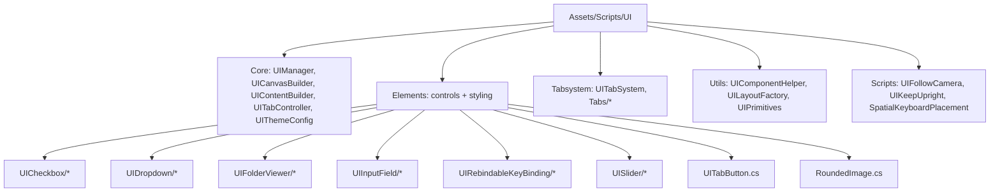
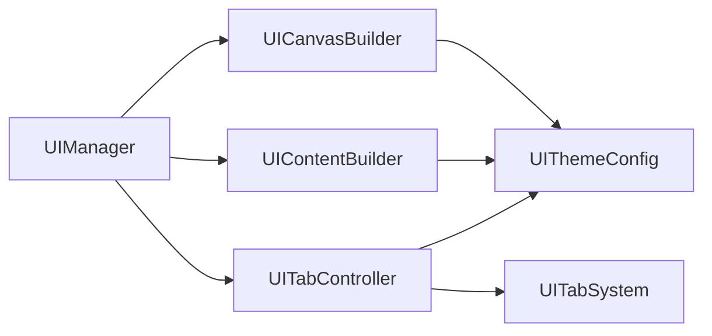
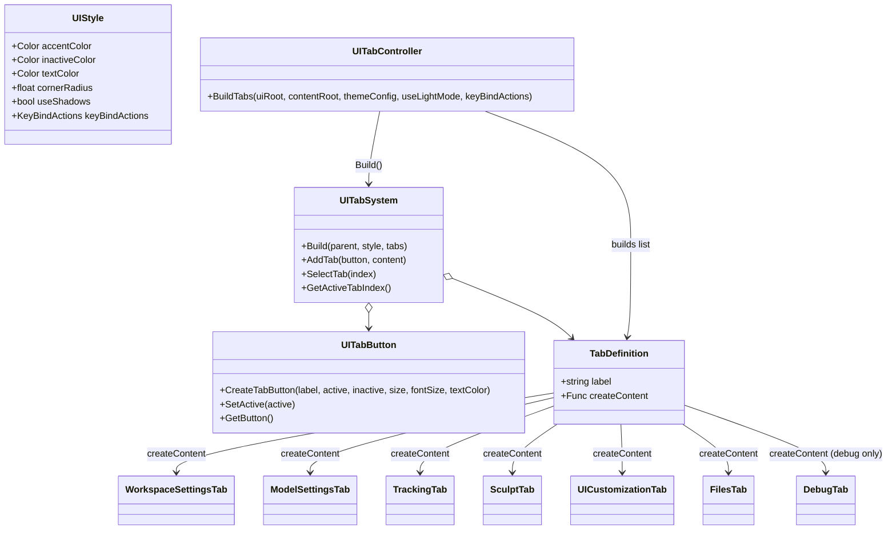
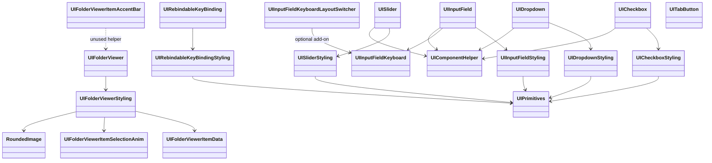
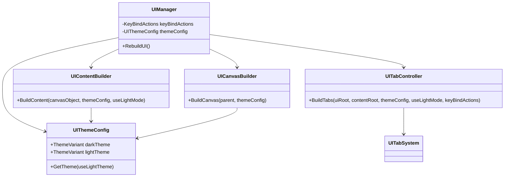

# UI Folder UML

This document summarizes the `Assets/Scripts/UI` folder structure and the main relationships between UI classes. Diagrams are Mermaid-based so they render in IDEs that support Mermaid.

**Folder Map**

**UI Build Pipeline**

**Tab System**

**Elements and Styling**

**Core Classes**

**Notes**
- `UIManager` builds the world-space canvas, content panel, and tab system, and rebuilds the UI when theme settings change.
- `UITabController` wires the tab list and debug tab inclusion using `SettingsManager`.
- `UIFolderViewerItemAccentBar` is defined but not referenced by current UI construction code.
- `UIInputFieldKeyboardLayoutSwitcher` is optional and only works when an `XRKeyboardDisplay` exists on the same object.
